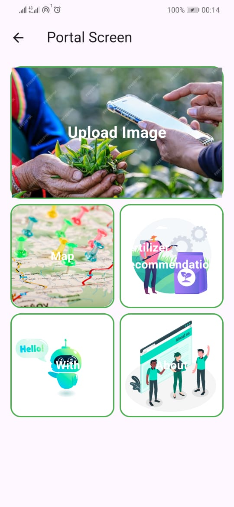
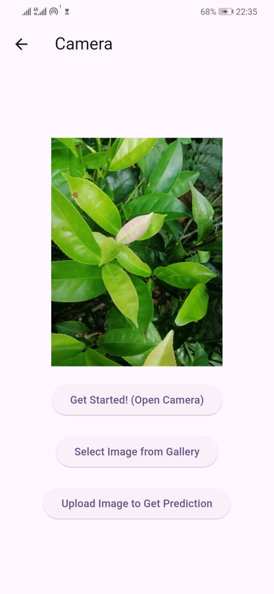
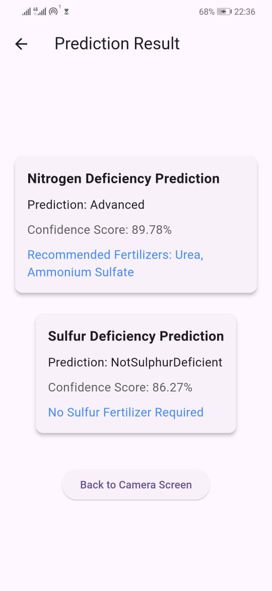
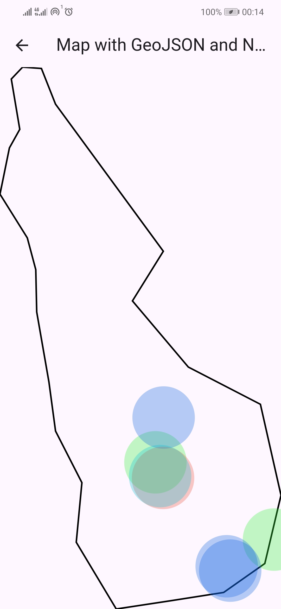

# Tea Leaf Scanner

## Overview

The **Tea Leaf Scanner** is a mobile application developed using **Flutter** for the frontend and **Django** for the backend. The app utilizes a **Vision Transformer model** deployed on **Hugging Face** to predict nutrient deficiencies in tea leaves and recommend appropriate fertilizers. The application provides users with insights into tea plant nutrition and suggests corrective actions based on AI-powered analysis.

## Features

- **Tea Leaf Nutrient Prediction**: Upload or capture an image of a tea leaf to receive predictions on nutrient deficiencies.
- **Fertilizer Recommendations**: Based on nutrient deficiencies, the app suggests appropriate fertilizers.
- **User-Friendly Interface**: A simple and intuitive UI designed for farmers and agricultural experts.
- **Real-time API Integration**: The Django backend fetches predictions from the Hugging Face Vision Transformer model and serves them to the mobile app.

## Tech Stack

### Frontend
- **Flutter** (Dart)
- **Provider** (State Management)
- **Dio** (HTTP Requests)
- **Image Picker** (For capturing and selecting images)

### Backend
- **Django** (Python Framework)
- **Django REST Framework (DRF)** (API Development)
- **Hugging Face Inference API** (Vision Transformer Model for prediction)
- **MySQL** (Database Management)

## System Architecture

1. The user uploads a tea leaf image via the mobile app.
2. The Flutter frontend sends the image to the Django backend through an API.
3. The Django backend processes the image and forwards it to the Vision Transformer model deployed on Hugging Face.
4. The model returns a prediction of possible nutrient deficiencies.
5. The backend processes the response and maps the deficiencies to recommended fertilizers.
6. The results are sent back to the mobile app and displayed to the user.

## Screenshots

Include screenshots of the application to showcase its features and UI:

### Home Screen

### Image Upload Feature

### Prediction Results

### Mapping

